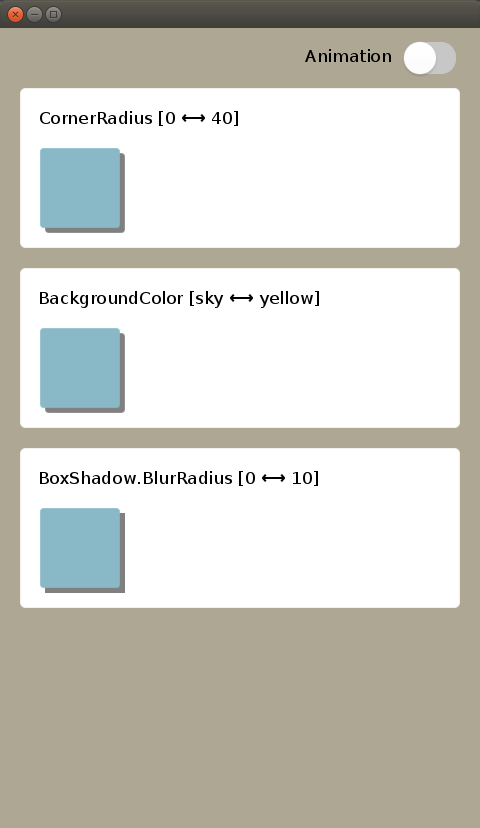
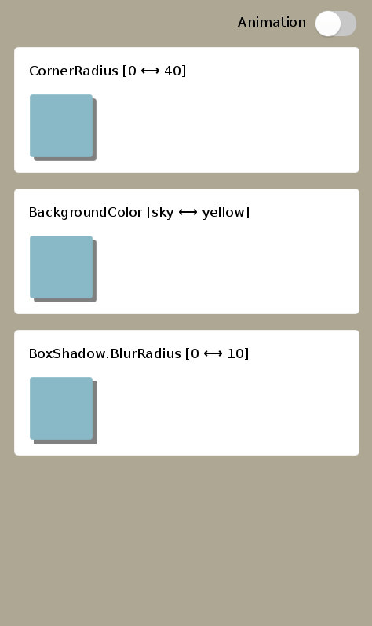

## Animating CornerRadius, BackgroundColor and BoxShadow

Like other animatable properties, you need to use `Animation` class and specify property name as a astring.

### CornerRadius
```C#
animation.AnimateTo(view, "CornerRadius", 10.0f);
animation.Play();
```


### Background
To animate BackgroundColor,
```C#
animation.AnimateTo(view, "BackgoundColor", new Color(r, g, b, a));
animation.Play();
```

If you want to animate alpha value only, please write `BackgroundOpacity` as a proeprty name and give float type value.
```C#
animation.AnimateTo(view, "BackgoundOpacity", 0.5f);
animation.Play();
```


### BoxShadow
The `BoxShadow` property is consist of several sub-properties.
To animate this, specify a sub-property with separator ".", for example, `BoxShadow.BlurRadius`.
```C#
animation.AnimateTo(view, "BoxShadow.BlurRadius", 10.0f);
animation.Play();
```

```C#
animation.AnimateTo(view, "BoxShadow.Color", new Color(r, g, b, a));
animation.Play();
```

To animate alpha value only, please use `BoxShadow.Opacity`.
```C#
animation.AnimateTo(view, "BoxShadow.Opacity", 0.5f);
animation.Play();
```

### Sample Preview
## (WIP)

<table style="text-align:center;">
  <tr>
    <th></th>
    <th></th>
  </tr>
</table>

